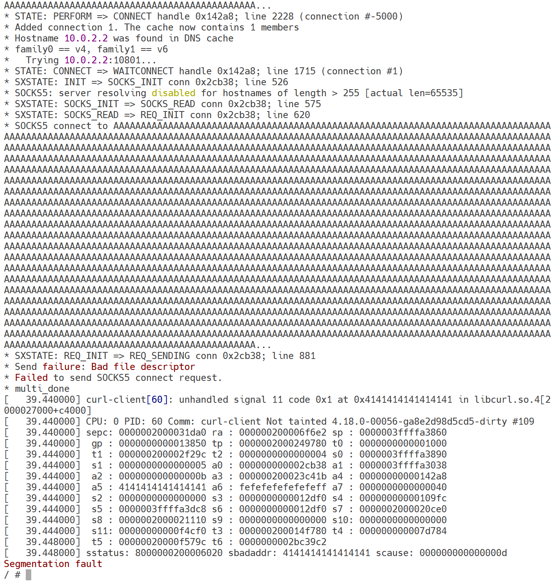

# Rootfs

## Introduction

This repository automates the process of setting up and managing a root filesystem (`rootfs`) with the necessary applications.

## Prerequisites

First, set the environment variables `RISCV` and `RISCV_ROOTFS_HOME`:

- `RISCV`: The top directory of your RISC-V toolchain binaries, such as `/opt/riscv`
- `RISCV_ROOTFS_HOME`: The top directory of this cloned repository

## Usage

### Initialization

Before building the `rootfs`, initialize the required git submodules:

```bash
make init
```

This command updates and initializes the submodules with a shallow clone (`--depth 1`).

### Building the Rootfs

To build the `rootfs`, run:

```bash
make all
```

This target compiles and installs the specified applications (in this case, `busybox`) and generates the initial RAM filesystem (`initramfs`) using a Python script located in the `utils` directory.

### Cleaning the Rootfs

To clean the build artifacts and directories, use:

```bash
make clean
```

This command cleans up the build directories of the specified applications and removes any generated `initramfs` files from the `rootfsimg` directory.

### Cleaning submodules

To remove all generated files inside submodules, run:

```bash
make repoclean
```

This command not only initiates a `make clean` operation but also extends its reach to clean up any generated files residing within the submodules.

### Deinitialization

To deinitialize and remove all git submodules, run:

```bash
make distclean
```

This command forcefully deinitializes all submodules, which is useful when you are about to switch git branches.

### Generating initramfs manually

To manually generate initramfs.txt, use:

```bash
make initramfs
```

This command is particularly useful when you need to modify or update the rootfsimg either after `make all` or independently of it.

### Steps to reproduce CVE-2023-38545

To reproduce the vulnerability identified as CVE-2023-38545, follow these detailed steps:

1. **Set up the servers on the host machine:**
   - Start a Socks5 server and a malicious HTTP server by running the following commands in your terminal:

     ```bash
     python utils/tgsocksproxy.py
     ./malicious_redirect_server.sh
     ```

   - Ensure that both services are running without errors.

2. **Execute the curl-client on the remote machine:**
   - On the remote machine, such as QEMU, run the following command to initiate the test:

     ```bash
     /root/curl-client -s socks5h://10.0.2.2:10801
     ```

   - This command will attempt to use the curl-client to connect to the malicious HTTP server through the Socks5 server.

3. **Observe the result:**
   - If everything goes well, you will observe the curl-client crashing, as shown in the following output:

     

   - This crash indicates that the vulnerability has been successfully triggered.

## References

* The socks proxy and the malicious HTTP server are not self-made. The original code can be found in https://github.com/vanigori/CVE-2023-38545-sample
* The hackerone report, which saved tons of research time. Give this a read through if you want to understand how this exploit occurs: https://hackerone.com/reports/2187833