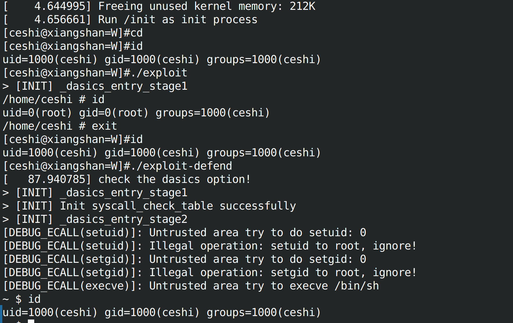

# SUDO CVE

## 编译

1. 编译时需要使用 glibc 2.31 版本的 toolchain

## 执行步骤

1. Linux 启动后 cd 进入到 /home/ceshi 的目录
2. 执行 id 命令查看当前用户
3. 执行 exploit 执行未保护情况下的权限攻击，可见执行后启动了一个新的 shell
4. 在上一步生成的 shell 中执行 id 查看到为 root 权限，随后 exit 退出
5. 执行 id 命令查看当前用户
6. 执行 exploit-defend 执行开启保护情况下的权限攻击，可见执行后打印出截获的系统调用的情况，避免进一步造成权限提升的危害
7. 执行 id 命令查看用户情况可见并未达到权限提升

